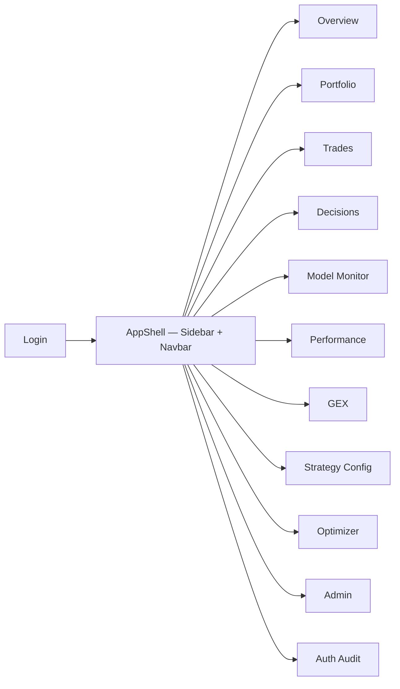
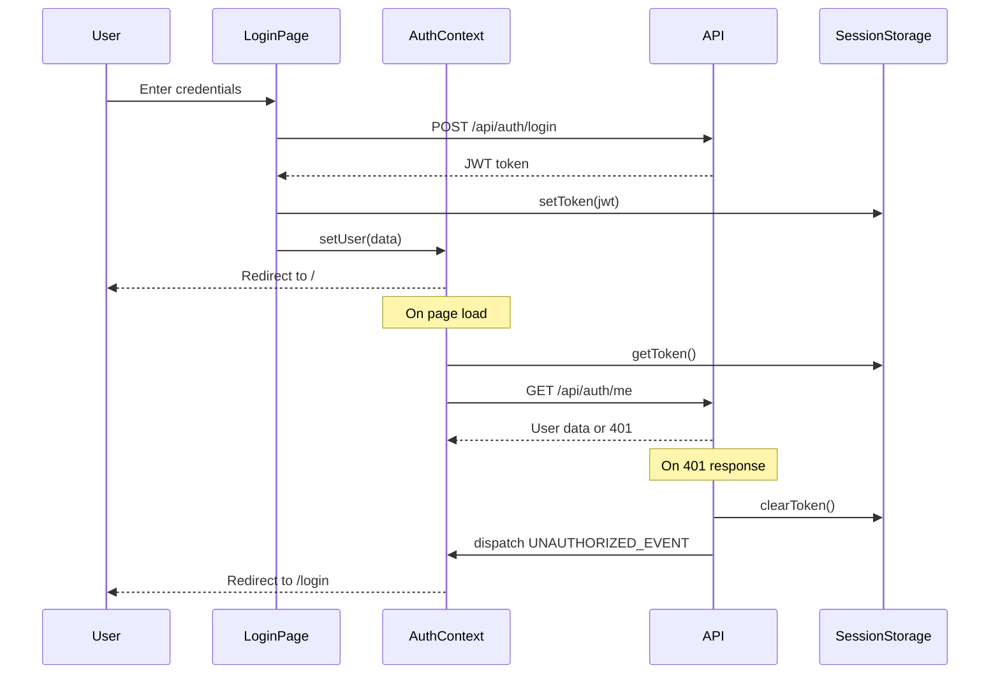

# IndexSpreadLab -- Frontend

React 18 single-page dashboard for monitoring the IndexSpreadLab live trading pipeline, viewing portfolio performance, exploring optimizer results, and managing system operations.

---

## Stack

- **React 18** with TypeScript
- **Vite** for dev server and production builds
- **Tailwind CSS v4** with `@tailwindcss/vite` plugin
- **Radix UI** primitives (tabs, dialog, dropdown, select, tooltip, scroll-area, etc.)
- **Recharts** for charts (equity curves, GEX strike curves, accuracy timelines)
- **Lucide React** for icons
- **Vitest** + Testing Library for tests

---

## Pages



| Route | Page | Description |
|-------|------|-------------|
| `/login` | LoginPage | Username/password form; JWT login via AuthContext |
| `/` | OverviewPage | Cockpit: KPI stat cards, mini equity chart, recent trades, pipeline warnings |
| `/portfolio` | PortfolioPage | Portfolio KPIs, event-signal badges, 90-day equity chart, source-filtered trades |
| `/trades` | TradesPage | Full trade list with source filter (all/scheduled/event), open/closed tabs |
| `/decisions` | DecisionsPage | Decision log with filters; click row for detail drawer (legs, strategy JSON) |
| `/model` | ModelMonitorPage | Model ops KPIs, accuracy chart, calibration scatter, confusion matrix, PnL attribution |
| `/performance` | PerformancePage | Performance analytics: mode selector, lookback filter, equity + drawdown charts, breakdowns |
| `/gex` | GexPage | GEX snapshots by underlying/source/DTE, composed chart with spot + zero-gamma lines |
| `/strategy` | StrategyConfigPage | Active config from live API + hardcoded backtest metrics + walk-forward table |
| `/optimizer` | OptimizerPage | Run picker, Pareto scatter, paginated results, multi-config compare, walk-forward charts |
| `/admin` | AdminPage | Preflight health cards, DB counts, manual job triggers with JSON result panel |
| `/admin/auth-audit` | AuthAuditPage | Admin-only auth audit table with detail drawer (geo/details JSON) |

Overview and Optimizer are lazy-loaded with `React.lazy` + `Suspense`. All routes except `/login` are wrapped in `ProtectedRoute` which redirects unauthenticated users.

---

## Components

### App Chrome (`src/app/`)

- **AppShell** -- Sidebar + top navbar + `<Outlet />` for page content.
- **Sidebar** -- Nav links to all main routes. Responsive: drawer on mobile, fixed on desktop.
- **Navbar** -- Title, market-hours badge (green during RTH), pause/resume refresh, user dropdown, logout.

### Shared (`src/components/shared/`)

- **DataTable** -- Generic table with column definitions, optional row `render` overrides, click handler, keyboard accessibility.
- **StatCard** -- Title/value card with optional icon, subtitle, and trend coloring (up = green, down = red).

### UI Primitives (`src/components/ui/`)

Shadcn-style components built on Radix + CVA (class-variance-authority):

- **Button** -- Variants: default, secondary, ghost, destructive, outline. Sizes: default, sm, lg, icon. Supports `asChild` via Radix Slot.
- **Badge** -- Semantic variants: default, profit, loss, warning, muted, outline.
- **Card** -- `Card`, `CardHeader`, `CardTitle`, `CardContent`.
- **Tabs** -- Radix tabs with styled list/trigger/content.

### Shared Utilities

- **ProtectedRoute** (`src/components/ProtectedRoute.tsx`) -- Redirects to `/login` if no JWT token after auth bootstrap.
- **ErrorBoundary** (`src/components/ErrorBoundary.tsx`) -- Class boundary that shows error message with retry button.

---

## API Client

All API calls live in a single file: `src/api.ts`.

- **`API_BASE`** -- Read from `import.meta.env.VITE_API_BASE_URL`.
- **`fetchWithAuth(url, options)`** -- Adds `Authorization: Bearer <token>` header. On 401 response, clears token and dispatches `UNAUTHORIZED_EVENT` (caught by `AuthContext` to redirect to login).
- Typed fetch functions for each endpoint group: admin triggers, GEX data, trades, decisions, performance analytics, model ops, portfolio, optimizer.

---

## Auth Flow



- JWT stored in `sessionStorage` (cleared on tab close).
- Token management in `src/auth.ts`: `getToken()`, `setToken()`, `clearToken()`.
- `AuthContext` (`src/contexts/AuthContext.tsx`) wraps the app, provides `user`, `login()`, `register()`, `logout()`.

---

## Auto-Refresh Hook

`src/hooks/useAutoRefresh.ts` provides market-hours-aware polling:

- Returns a `tick` counter that increments on a configurable interval (default 60s).
- Only increments during US market hours (Mon-Fri, 9:30-16:00 ET) unless `alwaysActive` is set.
- Exposes `paused` / `setPaused` for manual control from the Navbar.
- Exposes `isMarketHours` boolean for the market-hours badge.
- Pages use `tick` as a `useEffect` dependency to re-fetch data.

---

## Development

### Prerequisites

- Node.js 18+
- npm

### Commands

```bash
# Install dependencies
npm install

# Start dev server (http://localhost:5173)
npm run dev

# Type check
npx tsc --noEmit

# Run tests
npm run test

# Run tests in watch mode
npm run test:watch

# Production build
npm run build

# Preview production build
npm run preview
```

### Environment Variables

Copy `frontend/.env.example` to `frontend/.env`:

| Variable | Description | Example |
|----------|-------------|---------|
| `VITE_API_BASE_URL` | Backend API base URL | `http://localhost:8000` |
| `VITE_ADMIN_API_KEY` | Optional admin API key | *(empty for local dev)* |

---

## Project Structure

```
src/
  main.tsx              Entry point: BrowserRouter + AuthProvider + Routes
  api.ts                Typed API client with fetchWithAuth
  auth.ts               JWT sessionStorage helpers
  index.css             Tailwind base styles

  app/
    AppShell.tsx         Layout: sidebar + navbar + outlet
    Sidebar.tsx          Navigation links (responsive drawer on mobile)
    Navbar.tsx           Title, market badge, pause/resume, user menu

  pages/
    LoginPage.tsx        Auth form
    OverviewPage.tsx     Dashboard cockpit (lazy)
    PortfolioPage.tsx    Portfolio view
    TradesPage.tsx       Trade browser
    DecisionsPage.tsx    Decision log
    ModelMonitorPage.tsx ML model monitoring
    PerformancePage.tsx  Performance analytics
    GexPage.tsx          GEX visualization
    StrategyConfigPage.tsx  Strategy config + backtest metrics
    OptimizerPage.tsx    Optimizer dashboard (lazy)
    AdminPage.tsx        Admin operations
    AuthAuditPage.tsx    Auth audit log

  components/
    ProtectedRoute.tsx   Auth guard
    ErrorBoundary.tsx    Error boundary
    shared/
      DataTable.tsx      Generic data table
      StatCard.tsx       KPI stat card
    ui/
      button.tsx         Button component (CVA + Radix)
      badge.tsx          Badge component
      card.tsx           Card layout
      tabs.tsx           Tab navigation

  contexts/
    AuthContext.tsx       JWT auth state management

  hooks/
    useAutoRefresh.ts    Market-hours-aware polling

  lib/
    utils.ts             cn(), formatCurrency, formatPercent, formatDate, timeAgo

  test/
    setup.ts             Vitest setup
    *.test.tsx           Page and component tests
```
